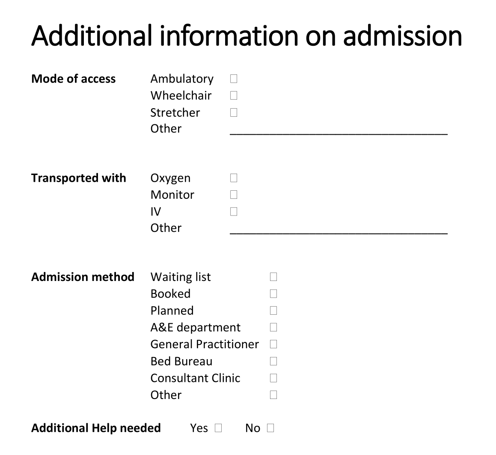

# Practical modelling tasks

These are the practical modelling tasks for the Practical Clinical Modelling Workshop. Make sure you've completed the [Getting started](getting-started.md) steps before starting these exercises.

## Exercise 1: Tidy and extend the starter template

A starter template is rarely fit for purpose as-is: archetypes are deliberately broad so they can be reused everywhere, so the job of template design is narrowing each one down to what this specific form needs, and pulling in extra archetypes for what it's still missing.

### 1.1 Problem/Diagnosis

Renaming and constraining the archetype to just what's needed keeps the form focused on what the clinician actually has to record, without hiding that the underlying archetype still supports the fuller concept elsewhere.

- Rename the `Problem/Diagnosis EVALUATION archetype` to 'Main Diagnosis'
- Constrain out everything apart from 'Problem/Diagnosis name'

!!! tip
    You can use the Form tab (on top next to Definition) to get an indication of what your form looks like!

### 1.2 Adverse Reaction Risk

Patients often have more than one allergy, so the archetype needs to repeat; reusing the 'Adverse reaction event' CLUSTER for each reaction, rather than modelling it again, is the reuse principle in action, and making the reaction detail mandatory avoids an unsafe blank entry for a safety-critical field.

- Add the `Adverse reaction risk EVALUATION archetype` under the Allergies section
- Set its occurrences to 0..* to allow multiple allergies to be recorded
- Constrain out everything apart from 'Substance' and rename it to 'Allergy'
- Add the `Adverse reaction event CLUSTER archetype` to the 'Reaction event summary' slot
- Constrain out everything apart from 'Manifestation'
- Rename ‘Manifestation’ to ‘Reaction’ and make it mandatory

### 1.3 Medication Order

Cloning an existing data element instead of authoring a new one shows how a single archetype element can be reused twice within the same template for two different purposes.

- Clone 'Specific directions description'
- Rename one to 'Dose' and the other to 'Frequency'

### 1.4 Vital Signs section

Pulling in a second OBSERVATION archetype (pulse oximetry) alongside blood pressure shows how a template section aggregates several independent archetypes into one clinical picture, while making systolic/diastolic mandatory demonstrates enforcing data completeness at the template level without changing the archetype itself.

- Add the `Pulse oximetry OBSERVATION archetype` into the Vital Signs template section, after 'Blood pressure'
- Constrain out everything apart from 'SpO2' ratio
- Make 'Systolic' and 'Diastolic' in 'Blood pressure' mandatory

### 1.5 Add Clinical Frailty Scale

This walks through the full reuse workflow that CKM is built around: search CKM first, and only author something new if nothing suitable already exists.

- Find the `Clinical Frailty Scale (CFS) OBSERVATION archetype` on the openEHR International CKM: [https://ckm.openehr.org/ckm/archetypes/1013.1.4691/export](https://ckm.openehr.org/ckm/archetypes/1013.1.4691/export) (best opened in a new tab)
- Press the 'Export ADL' button and save the archetype on your system
- Go back into Archetype Designer and go to 'Import' (top menu), then either 'Browse' to find the file on your system or drag and drop it into the grey box, then click 'Upload'
- Go back to your template, click on ‘content’, then pull in the Clinical Frailty Scale from the list of archetypes on the right

---

## Exercise 2: Create a new local archetype

After reviewing the template, the end users (nurses) have asked for a new section to be added for recording some additional information on admission.

You can view the original document here: ['Additional Information on Admission'](Additional%20information%20on%20admission.pdf) (best opened in a new tab)

{: .center-image style="width:60%" }

There is no suitable existing archetype in the CKM for this data, so, having exhausted the reuse-first step, we author a new one. It's modelled as an `ADMIN_ENTRY` rather than an `OBSERVATION` or `EVALUATION` because this is admission logistics, not a clinical finding.

- Create a new ADMIN_ENTRY archetype called `Inpatient admission details` and then add the following data elements:

### 2.1 Mode of access

- Ambulatory
- Wheelchair
- Stretcher
- Other: `_________________________________`

### 2.2 Transported with

- Oxygen
- Monitor
- IV
- Other: `_________________________________`

### 2.3 Admission method

- Waiting list
- Booked
- Planned
- A&E department
- General Practitioner
- Bed Bureau
- Consultant Clinic
- Other

### 2.4 Additional Help needed

- Yes
- No

Once you have created your new archetype, go back to your template:

- Select ‘content’, add your new archetype, and then Save the template

---

## Exercise 3: From 'Form-centric' to 'Patient-centric' modelling

A form models one encounter, but much of what it captures (like a patient's general mobility or preferred language) doesn't change between encounters and shouldn't need re-entering every time. Recognising which data is patient-level versus context-level is what lets a template be replaced by several smaller, reusable ones.

- Think about how we might re-organise this information into multiple templates to make it more 'patient-centric' and reduce the data entry burden for the nurses (and patients!)
- What information is about the patient in general (global) and what is about the immediate clinical context (contextual)?
- List any parts of this dataset that could be handled more globally for the patient
- Further reading: [CGEM framework](https://freshehr.notion.site/Introduction-to-the-CGEM-Framework-115ed58514b344da825c3b42c372aff2?pvs=74)
