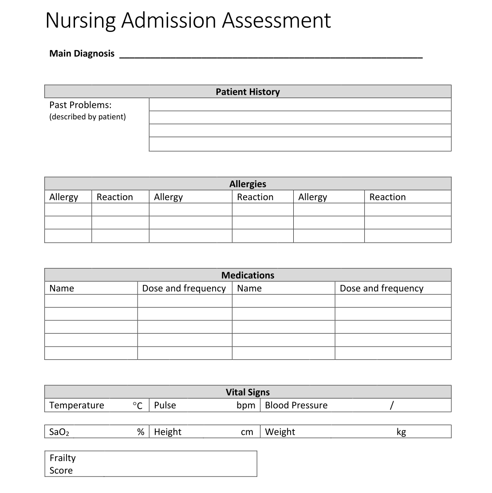

# Practical Clinical Modelling Workshop

In this session, we will go further into the key ideas behind archetypes and templates.

There will be a practical introduction to the openEHR Clinical Knowledge Manager and Archetype Designer clinical modelling tool, via a worked example based on a real clinical dataset.

## Getting started

- Open a web browser (Chrome or Firefox works best)
- Go to [https://tools.openehr.org/designer](https://tools.openehr.org/designer/) (best opened in a new tab)
- Login: `freshehr_training`
- Password: `ad4freshtraining`
- Choose the repository allocated to you – (A) Aberdeen, (B) Brechin, (C) Crieff, (D) Dundee, (E) Ellon, (F) Forfar, (G) Glasgow, (H) Hamilton, (I) Irvine, (J) Jedburgh
- Select `Nursing Admission Assessment STARTER.v0` in the list of templates
- Open the original ['Nursing Admission Assessment paper form'](Nursing%20Admission%20Assessment.pdf) (best opened in a new tab)

{: .center-image style="width:60%" }

Once you're set up, head to the [Exercises](exercises.md) page for the practical modelling tasks.
